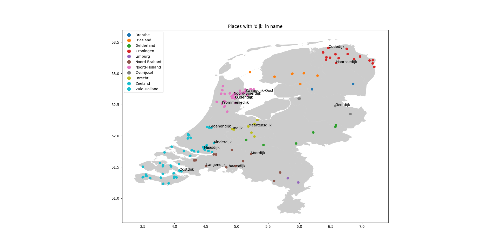

# Geographical Analysis of distribution Dutch settlements
This code extracts data about Dutch settlements from [Wikidata](https://www.wikidata.org/wiki/Wikidata:Main_Page), then uses [geopandas](https://geopandas.org/en/stable/) to map them on a geographical map of the Netherlands. The user can filter the settlements by a substring of their name, and only the settlements that contain this substrig are displayed. E.g `SUBSTRING` = 'dijk' it will plot only settlements with 'dijk' in there name





## Setup
Before running the code, you need to install some dependencies. You can do this by running the following command in your terminal:

```
pip install -r requirements.txt
```
You also need to set some parameters in the `parameters.py` file. You should set the `SUBSTRING` parameter to the substring you want to filter the settlements on, and the `PATH_TO_GEODATA` parameter to the path of the geojson that you want to use for plotting. As default this repo uses the geojson of the Netherlands

## Usage
You can run the code by running the `main.py` script in your terminal:

```
python main.py
```
This will run the entire pipeline, from extracting the data from Wikidata to plotting it on a map. The resulting plot will be displayed in your console.

## Code Structure
The code is divided into several modules, each of which performs a specific task:

 - `extraction.py`: Contains the WikiDataQueryResults class, which allows you to extract data from Wikidata using SPARQL queries.
- `queries.py`: Contains the SPARQL queries that are used to extract data from Wikidata.
- `transform.py`: Contains the get_latitude_and_longitude and get_geodataframe functions, which transform the extracted data into a format that can be plotted on a map.
- `visualize.py`: Contains the plot_on_map function, which plots the data on a map.
- `parameters.py`: Contains the parameters that are used in the code.
- The main script, `main.py`, imports these modules and runs the entire pipeline.
